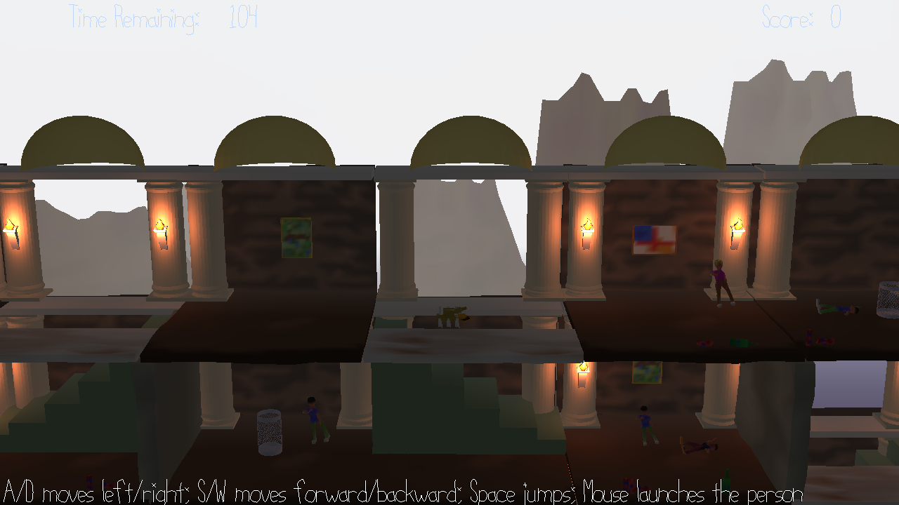

# SquidgeBall

Author: Thomas Wrabetz

Design: It's a squishy ball

Screen Shot:

How To Play:

WASD to move, click the mouse and then move it to rotate camera. Space to jump. The ball is squishy and the further you fall, the further you bounce back up. Reach the red platform to win (spiritually, that is). If you can't reach the red platform, try again, because as you can see by the screenshot it's totally possible.

Sources: No external assets.

This game was built with [NEST](NEST.md).

